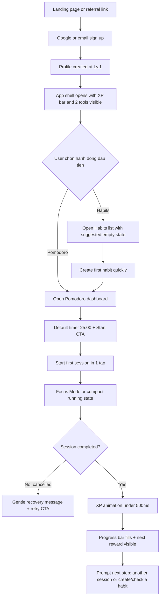
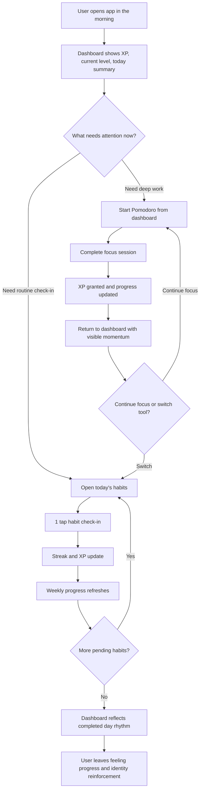
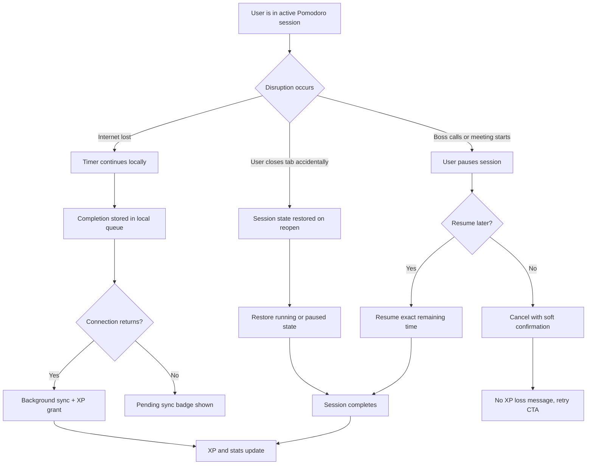

# UX Design Specification JL-Tools

**Author:** Lucas
**Date:** 2026-03-30

---

<!-- UX design content will be appended sequentially through collaborative workflow steps -->

## Executive Summary

### Project Vision

JL-Tools là nền tảng productivity all-in-one với gamification RPG xuyên suốt, nơi mọi hành động tích cực (Pomodoro + Habit) đều đóng góp vào cùng một hệ thống XP/Level thống nhất. Aesthetic dark neon immersive tạo trải nghiệm "game" thay vì "work tool". Tagline: "Làm chủ thời gian. Tối đa giá trị."

### Target Users

| Persona | Tuổi | Mô tả | Thiết bị |
|---------|------|--------|----------|
| Minh | 21 | Sinh viên CNTT, cần chống lướt YouTube khi học | Laptop + Điện thoại |
| Hà | 28 | Nhân viên marketing, bị interrupt liên tục, muốn work-life balance | Laptop + Điện thoại |
| Khoa | 25 | Freelance designer, tự giám sát bản thân, deadline gấp | MacBook + Điện thoại |
| Linh | 23 | Content creator, cần track từng phase công việc | iMac + Điện thoại |
| Lucas | - | Founder, cần validate PMF qua metrics | Laptop |

### Key Design Challenges

1. **Zero Setup, Deep Engagement:** Mở app là bắt đầu dùng ngay — không blank canvas như Notion. Gamification phải đủ sâu để giữ chân dài hạn mà không làm complexity tăng.
2. **Gentle vs. Effective Gamification:** Miss habit → reset streak nhưng không mất XP. Tìm điểm cân bằng giữa khuyến khích và trừng phạt.
3. **Cross-Device Immersive Consistency:** Focus Mode desktop (ẩn sidebar, fullscreen) vs. bottom nav mobile. Aesthetic neon dark phải nhất quán 375px → desktop.

### Design Opportunities

1. **XP Bar = Tim đập của Platform:** XP bar trên sidebar là điểm kết nối mọi tool — cơ hội micro-animation cực kỳ satisfying, level-up celebration moment.
2. **"Mở là dùng" Onboarding:** Aha moment ngay lần đầu hoàn thành Pomodoro → thấy XP nhích → muốn thêm 1 phiên nữa.
3. **Streak as Social Currency:** Streak fire emoji → screenshot-worthy → viral loop tự nhiên. Thiết kế streak UI maximize shareability.

## Core User Experience

### Defining Experience

**Core Loop chính:** Hoàn thành Pomodoro (focus) + Check-in Habit → nhận XP → lên Level → quay lại tiếp.

Hành động cốt lõi nhất: **"Hoàn thành một phiên focus Pomodoro"** — đây là nguồn gốc của tên sản phẩm và giá trị cốt lõi. Mọi thứ khác (habits, XP, streaks) đều phục vụ cho việc user hoàn thành được nhiều focus sessions hơn.

**Effortless by Design:**
- Mở app → sidebar hiện sẵn 2 tools + XP bar
- Bấm Start → timer 25:00 bắt đầu ngay, không cần setup
- Hoàn thành → XP animate < 500ms → satisfying feedback
- Check-in habit → 1 tap, micro-animation xác nhận

### Platform Strategy

| Khía cạnh | Chiến lược |
|-----------|-----------|
| **Loại** | Web application (Next.js SPA) |
| **Primary devices** | Laptop/Desktop + Mobile phone |
| **Input** | Mouse/Keyboard (desktop) + Touch (mobile) |
| **Offline** | Timer 100% client-side, session queue sync khi reconnect |
| **Breakpoints** | Mobile-first: 375px+ → Tablet → Desktop |
| **Default theme** | Dark mode neon aesthetic |

**Responsive behavior:**
- Mobile (375-768px): Bottom navigation bar, single column, full-width timer display
- Tablet (768-1024px): Collapsible sidebar, 2-column layouts
- Desktop (1024px+): Fixed sidebar (280px), multi-column dashboard

### Effortless Interactions

| Tương tác | Thiết kế | UX Goal |
|-----------|---------|---------|
| **Start Pomodoro** | 1 tap/click → timer bắt đầu ngay | Zero friction start |
| **Check-in Habit** | Tap toggle → check mark animate → streak update | < 200ms response |
| **View Progress** | XP bar + level always visible in sidebar | Ambient awareness, no navigation needed |
| **Switch Tool** | Sidebar click → instant transition | < 100ms, feels like native app |
| **Focus Mode** | Auto-hide sidebar, only timer + session count visible | Full immersion, zero distraction |
| **Level Up** | Modal celebration → "Một bước tiến lớn!" | Emotional payoff, screenshot-worthy |

### Critical Success Moments

1. **First Pomodoro Completion (Ngày 1):** User hoàn thành session đầu tiên → thấy XP bar animate → "Ồ, satisfying!" → muốn thêm 1 phiên nữa. Đây là aha moment sớm nhất, phải hoàn hảo.

2. **First Level Up (Ngày 3-5):** Đủ XP → modal celebration với title mới ("Tân binh" → "Chiến binh kỷ luật") → emotional reward → intrinsic motivation hình thành.

3. **Streak Fire (Day 7):** 7 ngày liên tiếp → fire emoji streak → screenshot-worthy → social sharing → viral loop đầu tiên.

4. **Cross-Tool Usage (Tuần 1):** User dùng cả Pomodoro + Habit trong cùng tuần → thấy XP tăng nhanh hơn → "Cả 2 tool đều đóng góp vào level" → stickiness.

5. **Weekly Insight (Tuần 2+):** Xem weekly stats → "Tuần này focus 12 tiếng, 5/7 habits done" → bức tranh toàn cảnh → insight-driven retention.

### Experience Principles

1. **"Mở là dùng" — Zero Blank Canvas:** Khác Notion, JL-Tools có workflow sẵn. User không phải tự setup — mở app là bắt đầu. Mọi default phải hợp lý từ đầu.

2. **Reward Loop < 500ms:** Mọi hành động tích cực (hoàn thành session, check-in habit) phải có visual/audio feedback trong < 500ms. Timing là mọi thứ cho gamification.

3. **Gentle Accountability:** Streak reset khi miss nhưng không mất XP. Khuyến khích > trừng phạt. Design không tạo anxiety — tạo momentum.

4. **Immersive When Needed, Informative When Idle:** Khi đang trong phiên focus → ẩn mọi thứ, chỉ timer. Khi idle → sidebar hiện đầy đủ XP, streaks, navigation.

5. **Screenshot-Worthy Moments:** Streak fire, level-up celebration, weekly stats → phải đủ đẹp và satisfying để user tự nguyện share → organic growth.

## Desired Emotional Response

### Primary Emotional Goals

**Cảm xúc chính: Momentum → Accomplishment → Relief → Identity → Delight**

*(Hệ thống theo thứ tự trigger — momentum là điểm khởi đầu, identity là đích đến dài hạn)*

| Mục tiêu | Mô tả | Trigger UX | User Stage |
|-----------|-------|------------|------------|
| **Momentum** | "Mình đang trên đà tiến bộ" | XP bar tăng dần, streak counter, level progress bar | **Ngày 1+** — trigger sớm nhất |
| **Accomplishment** | "Mình đạt được nhiều thứ hơn mình nghĩ" | Session complete → XP animate, daily stats review | **Ngày 1+** — mỗi session |
| **Relief / Escape** | "Cuối cùng cũng được tập trung" | Focus Mode → sidebar disappears, only timer visible | **Khi cần deep work** |
| **Identity** | "Mình là người có kỷ luật" | Level titles có personality, long-term streak (30+ days) | **Tuần 2+** — shift dần |
| **Delight** | "App này cool và vui" | Micro-animations, level-up celebration, neon aesthetic | **Xuyên suốt** |

**Ghi chú quan trọng (từ Party Mode review):**
- **Empowerment** là **kết quả dài hạn**, không phải trigger tức thì. User không bắt đầu bằng "mình làm chủ được thời gian" — họ bắt đầu bằng momentum.
- **"Flow"** được đổi thành **"Sustained Focus"** — Flow state thực sự (Csikszentmihalyi) đòi hỏi 15-30 phút uninterrupted, không phải lúc nào Pomodoro cũng đạt được.
- **Identity** là primary emotional goal mạnh nhất — nó tạo retention vượt beyond app utility. Khi user tự nhận "mình là Chiến binh kỷ luật", app trở thành part of self.

**Cảm xúc cần TRÁNH:**

| Emotion | Trigger | Mitigation |
|---------|---------|-----------|
| **Anxiety / Guilt** | Streak miss → strict punishment | Gentle: reset streak nhưng giữ XP, never forced check-in |
| **Confusion** | Blank canvas, too many options | "Mở là dùng", smart defaults, progressive disclosure |
| **Overwhelm** | Quá nhiều stats/options | Progressive disclosure — today's data first |
| **Addiction / Compulsion** | Streak fear → check-in khi không muốn | Gentle reminder only, never dark patterns |
| **Comparison / Inadequacy** | Leaderboard (future) → "mình kém hơn người khác" | No leaderboard MVP, individual progress only |
| **Decision Fatigue** | Quá nhiều customize options | Smart defaults, hide advanced options |

### Emotional Journey Mapping

| Giai đoạn | Cảm xúc mong muốn | UX Trigger | Đo lường |
|-----------|------------------|------------|----------|
| **Discovery** | Tò mò, hứng thú | Social proof: "Lv.10" screenshot trên MXH, tagline "Làm chủ thời gian" | Referral rate |
| **Onboarding (0-5 phút)** | Empowering, immediate value | Google login → Lv.1 → XP bar visible → Start → value ngay | Activation rate ≥ 60% |
| **First Pomodoro Done** | Accomplished, delighted | XP +50 → bar animate → "Thêm 1 phiên nữa!" | Session completion rate ≥ 75% |
| **First Level Up** | Proud, excited | Celebration modal → title mới → "Mình đang tiến bộ!" | D3 retention |
| **Streak Fire (Day 3-7)** | Momentum, commitment | Fire emoji → streak count → "Mình đang có streak!" | Streak ≥ 7 days ≥ 30% |
| **Streak Reset (miss day)** | Mild disappointment, no guilt | Gentle modal: "Streak reset nhưng bạn giữ nguyên XP. Bắt đầu lại nhé!" | Streak reset → return rate |
| **Weekly Stats Review** | Surprised, proud | "Tuần này focus 12 tiếng, 5/7 habits" | NPS ≥ 40 |
| **Long-term (Month 2+)** | Identity shift | "Mình là người có kỷ luật" — level title + 30+ day streak | D30 retention ≥ 20% |

### Micro-Emotions

| Cặp đối lập | JL-Tools Target | Thiết kế để đạt |
|-------------|----------------|----------------|
| Confidence ↔ Confusion | **Confidence** | Zero setup, clear hierarchy, progressive disclosure |
| Trust ↔ Skepticism | **Trust** | XP calculations transparent, streak accurate, no dark patterns |
| Relief ↔ Anxiety | **Relief** | Focus Mode = escape from interruptions, gentle streak reset |
| Excitement ↔ Burnout | **Excited** | Celebration moments, never forced. Gamification enhances, not burdens |
| Accomplishment ↔ Frustration | **Accomplishment** | Every completed session = XP, every check-in = streak |
| Delight ↔ Indifference | **Delight** | Micro-animations, neon aesthetic, level-up celebrations |
| Momentum ↔ Stagnation | **Momentum** | XP bar always visible, level within reach, new mechanics unlock |

### Design Implications

| Cảm xúc | UX Design Trigger | Chi tiết Implementation |
|---------|------------------|------------------------|
| **Momentum** | XP bar animate + streak counter + progress bar | Bar luôn visible trên sidebar, streak count tăng màu theo length |
| **Accomplishment** | XP gain + session complete animation | < 500ms feedback, satisfying visual pulse |
| **Pride** | Level-up modal + title reveal | Celebration animation, shareable screenshot, title có personality |
| **Relief / Escape** | Focus Mode (full immersion) | Sidebar disappears, only timer + session count + XP preview |
| **Identity** | Level titles + avatar + long-term streak | Titles có character ("Chiến binh kỷ luật"), không generic ("Level 10") |
| **Delight** | Micro-animations everywhere | Check-in: ripple effect, XP: number flies up, streak: flame flicker |
| **Safe to Fail** | Gentle streak reset | Modal nhẹ nhàng, không guilt, encourage restart |

### Emotional Design Principles

1. **Reward Every Micro-Win:** Mọi hành động tích cực đều được recognize. XP cho session, XP cho check-in, streak fire. User luôn thấy progress → momentum built.

2. **Celebrate, Don't Punish:** Miss = streak reset (gentle). Không mất XP, không mất level. UI never creates guilt/anxiety — chỉ motivation để restart.

3. **Momentum First, Empowerment Follows:** User không bắt đầu với "mình kiểm soát được" — họ bắt đầu với streak 3 ngày. Empowerment là kết quả của accumulated momentum.

4. **Satisfying Feedback < 500ms:** Visual feedback cho mọi action. XP bar tăng phải nhìn thấy. Check-in phải có animation. Level-up phải là moment đặc biệt.

5. **Immersion on Demand:** Focus Mode = complete immersion. Idle state = informative. User control khi nào cần tập trung, khi nào cần overview.

6. **Identity Through Titles:** Level titles phải có personality. Không "Level 5" mà "Chiến binh kỷ luật". Titles là markers của self-identity — user tự hào khi share.

7. **Social by Default, Comparison Never:** Streak fire + level screenshots được thiết kế để share. Không leaderboard (MVP) — individual progress, không so sánh với người khác.

## UX Pattern Analysis & Inspiration

### Inspiring Products Analysis

#### Primary Inspiration Sources

| Sản phẩm | Lý do chọn | UX strengths | UX weaknesses |
|---------|-----------|--------------|---------------|
| **Duolingo** | Benchmark tốt nhất cho streak + celebration + gentle approach | Streak visible everywhere, milestone celebrations, streak freeze, "streak on the line" warning | Learning context khác productivity |
| **Forest** | Pomodoro gamification reference | Simple 1-tap start, "đang làm điều tốt" framing, screenshot-worthy forest visual | Mobile only, gamification đơn điệu (chỉ tree) |
| **Finch** | Gentle accountability reference | Pet evolves, gentle message when miss, no punishment | Chỉ wellness, không productivity tools |
| **Habitica** | Deep RPG gamification (để tránh) | Full RPG system (HP, pets, quests, avatar) | UI cũ, complexity overload, punishment-heavy |
| **TickTick** | All-in-one productivity (để tránh) | Nearest competitor, good task/habit management | Zero gamification, boring |
| **Notion** | Blank canvas anti-pattern | Flexible, powerful | "Notion procrastination" — blank canvas overwhelm |

#### Pattern Analysis: Streak Systems

| App | Streak UX | Gentle? | Celebration? | JL-Tools Take |
|-----|-----------|---------|--------------|--------------|
| Duolingo | ✅ Counter visible, streak freeze option | ✅ Yes | ✅ Milestone animations | Adopt: streak freeze (MVP?), milestone celebrations |
| Forest | ✅ Tree planted per session | ✅ Gentle (just miss tree) | ✅ Tree forest = progress | Adopt: "focus = doing something good" framing |
| Habitica | ✅ Dailies streak | ❌ No (lose HP on miss) | ⚠️ Too many | Avoid: HP/punishment system |
| Finch | ✅ Care streak, gentle miss | ✅ Yes | ✅ Pet evolves | Adopt: gentle reset message |
| JL-Tools | Target: streak counter + fire + reset | ✅ Gentle (no XP loss) | ✅ At milestones | Build: own streak system |

#### Pattern Analysis: Level / Progression Systems

| App | Level UX | Identity? | Celebration? | JL-Tools Take |
|-----|---------|-----------|--------------|--------------|
| Duolingo | Hearts/lives + league | ⚠️ Minimal | ✅ Yes (big moments) | Partial: celebration timing |
| Habitica | Full RPG levels | ✅ Avatar + class | ✅ Many | Avoid: overkill complexity |
| Forest | Forest size (indirect) | ⚠️ Minimal | ✅ Tree growth | Avoid: too indirect |
| JL-Tools | XP bar + level + title | ✅ "Chiến binh kỷ luật" | ✅ Level-up modal | Build: simple + personality |

### Transferable UX Patterns

#### Navigation & Layout Patterns
- **Persistent Sidebar (Dashboard Pattern):** XP bar + navigation always visible → ambient awareness. Reference: Notion sidebar, Spotify sidebar.
- **Bottom Nav (Mobile):** Mobile users switch between Pomodoro/Habits. Reference: Spotify, Instagram.
- **Immersive Fullscreen Mode:** Focus Mode = hide all chrome. Reference: YouTube fullscreen, reading apps.

#### Interaction Patterns
- **One-Tap Action (Forest):** Bấm 1 nút → bắt đầu ngay. Không cần setup. JL-Tools: Start Pomodoro = 1 tap.
- **Check-in Toggle (Finch/Habitica):** Tap → done. Instant feedback. JL-Tools: Habit check-in = 1 tap + micro-animation.
- **Streak Counter (Duolingo):** Streak number prominently displayed. Fire emoji khi ≥ 3. JL-Tools: fire bên cạnh habit name.

#### Visual & Feedback Patterns
- **Progress Bar Animation (Spotify):** XP bar animate smoothly. Satisfying micro-interaction.
- **Celebration Modal (Duolingo):** Big moment when reaching milestone. Level-up modal JL-Tools = same energy.
- **Neon Glow Aesthetic (Gaming):** Dark background + neon accent colors. Reference: gaming UIs, cyberpunk apps.
- **Gradient Color System (TikTok/Stories):** Streak fire gradient: yellow → orange → red theo streak length.

#### Anti-Patterns to Avoid
- **Habitica's Over-Complexity:** Quá nhiều mechanics (HP, pets, quests, armor) khiến user overwhelm. JL-Tools: chỉ XP + Level + Streak.
- **Notion's Blank Canvas:** Flexibility cao nhưng user không biết bắt đầu từ đâu. JL-Tools: "Mở là dùng" — workflow pre-built.
- **Forest's Mobile Limitation:** Chỉ có mobile app, không block desktop web. JL-Tools: web-first nhưng Focus Mode đủ immersive.
- **TickTick's Zero Gamification:** Nearest competitor nhưng không có emotional hook. JL-Tools: gamification is core differentiator.

### Design Inspiration Strategy

**What to Adopt (Directly):**
- **Duolingo streak freeze** — 1 miss không reset streak (MVP: có thể là premium feature)
- **Duolingo milestone celebrations** — 7, 14, 30, 100 day celebrations
- **Forest's "doing good" framing** — Focus Mode = "bạn đang làm điều tốt", không phải "bạn đang làm việc"
- **Finch's gentle miss message** — "Streak reset nhưng bạn giữ XP. Bắt đầu lại nhé!"
- **One-tap start pattern** — Start Pomodoro = instant, zero setup

**What to Adapt:**
- **Habitica's XP/Level system** — Simplified: chỉ XP + Level + Titles (no HP/pets/quests)
- **Spotify's sidebar UX** — JL-Tools sidebar với XP bar + navigation
- **TikTok streak gradient** — Fire emoji gradient theo streak length (3-7: yellow, 7-14: orange, 14+: red)

**What to Avoid:**
- **Habitica's punishment (HP loss)** — Gentle approach: streak reset nhưng không mất XP
- **Notion's blank canvas** — Pre-built workflow, "mở là dùng"
- **Over-complex gamification** — XP + Level + Streak là đủ cho MVP
- **Comparison/Leaderboard** — Individual progress only, no social competition (MVP)

## Design System Foundation

### 1.1 Design System Choice

**Selected: Tailwind CSS + shadcn/ui (Themeable System)**

| Component | Choice | Lý do |
|-----------|--------|-------|
| **CSS Framework** | Tailwind CSS | Utility-first, highly customizable, native dark theme support, neon glow + gradient effects |
| **Component Library** | shadcn/ui | Copy-paste components (not npm package), fully owned, Radix primitives for accessibility, WCAG 2.1 AA compliant |
| **Design Tokens** | Tailwind config + CSS variables | Centralized colors, spacing, typography tokens |
| **Animation** | Tailwind + Framer Motion (future) | CSS animations for MVP, Framer Motion for complex interactions (Phase 2+) |

### Rationale for Selection

| Factor | Analysis |
|--------|---------|
| **Speed** | shadcn/ui cung cấp production-ready components → reduce dev time 60-80% so với custom |
| **Customization** | Tailwind utility classes → neon glow, gradient streaks, dark theme deeply customizable |
| **Accessibility** | shadcn/ui dựa trên Radix primitives → keyboard nav, screen reader, focus management built-in |
| **Ownership** | shadcn/ui copy vào codebase → không phụ thuộc external package updates, fully customizable |
| **Dark Theme** | Tailwind dark mode native + shadcn/ui dark variants → JL-Tools aesthetic natural fit |
| **Team Fit** | Solo founder (developer) → cần fast iteration, not build components từ đầu |
| **Tech Stack Alignment** | Next.js + Tailwind là recommended combination → best practices, good docs |

**Đã loại trừ:**
- **Material Design / Ant Design:** Too "corporate" look, không phù hợp dark neon RPG aesthetic
- **Custom from scratch:** Mất thời gian, risk reinventing wheels, không justify được cho MVP scope
- **Pure CSS / styled-components:** Không scalable, khó maintain cho complex UI (XP bar, streaks, animations)

### Implementation Approach

**Phase 1 — MVP Foundation:**
```
1. Install Tailwind CSS với Next.js App Router
2. Configure Tailwind với JL-Tools design tokens (neon colors, dark palette)
3. Add shadcn/ui components: Button, Dialog, Modal, Progress, Toast
4. Build custom components trên nền shadcn/ui:
   - XpBar (Progress bar + animated fill)
   - StreakBadge (Fire emoji + count + gradient)
   - LevelUpModal (Celebration modal)
   - FocusTimer (Pomodoro timer display)
   - HabitCheckIn (Toggle với micro-animation)
5. Dark mode default — light mode toggle (Phase 4)
```

### Customization Strategy

| Area | Approach |
|------|---------|
| **Colors** | Tailwind config với JL-Tools neon palette |
| **Typography** | Inter font family (shadcn/ui default) + JetBrains Mono cho timer display |
| **Components** | shadcn/ui base → extend với JL-Tools variants (neon-glow button, streak-fire badge) |
| **Animations** | Tailwind CSS transitions (< 500ms for reward loops) |
| **Spacing** | Tailwind default scale (Tailwind là source of truth) |
| **Dark Theme** | Tailwind `dark:` variants + CSS variables for theming |
| **Custom Gamification UI** | Build on top of shadcn/ui primitives (Dialog, Progress, Toast) |

## 2. Core User Experience

### 2.1 Defining Experience

**The Defining Moment: "Focus Complete → Instant Reward"**

Core action users will describe to friends:
> *"Mình dùng app đó, mỗi lần hoàn thành được 25 phút focus là thấy thanh XP nhảy lên. Satisfying lắm!"*

**Why this is the defining experience:**
- Pomodoro timer đã có từ 1992 — không mới
- XP bar + instant feedback + animation — đây là điều KHÔNG CÓ ở competitors
- **Emotional payoff TỨC THÌ** sau sustained effort → đây là gamification hoạt động
- Kết hợp: sustained effort (25 phút focus) + immediate reward (XP animation) = core loop

**Unique Twist:** Không phải "gamification of productivity" (Habitica), không phải "productivity tool" (TickTick) — mà là **"productive gamification"** — productivity IS the game. Bạn không "chơi game để học" mà "học mà như đang chơi game."

### 2.2 User Mental Model

**Current Mental Model của target users:**

| Persona | Mental Model hiện tại | Shift cần thiết |
|---------|----------------------|----------------|
| Minh (Sinh viên) | "Học = khổ, chán" | "Học = đang level up bản thân" |
| Hà (Nhân viên) | "Timer = deadline pressure" | "Timer = achievement challenge" |
| Khoa (Freelancer) | "Track time = bị giám sát" | "Track time = đang chiến thắng sự trì hoãn" |
| Linh (Content) | "Productivity = công việc" | "Productivity = gameplay" |

**Mental Model Shift:**
- **Before:** Productivity = sacrifice, effort, discipline = pain
- **After:** Productivity = game, challenge, level up = fun
- **JL-Tools mechanic:** Biến pain thành fun THÔNG QUA instant feedback loops

### 2.3 Success Criteria

**Cho Defining Experience "Focus Complete → Instant Reward":**

| Criteria | Definition | Measurement |
|---------|-----------|-------------|
| **Instant Feedback** | XP animate < 500ms sau khi timer kết thúc | User survey: "Bạn thấy XP tăng ngay không?" |
| **Satisfying Animation** | Animation đủ "đã" để user muốn thêm 1 phiên | Session completion rate ≥ 75% |
| **Zero Confusion** | User hiểu ngay: "XP = tiến bộ" | Activation rate ≥ 60% hoàn thành session đầu |
| **Emotional Hook** | User muốn kể cho bạn về moment này | NPS ≥ 40, referral mentions XP bar |

### 2.4 Novel vs. Established Patterns

| Element | Type | Notes |
|---------|------|-------|
| **Pomodoro Timer** | Established (1992) | Users biết concept, không cần học |
| **XP/Level System** | Established (Habitica, Duolingo) | Users quen với gamification |
| **Instant XP Animation** | Novel within Pomodoro | Competitors (Forest, Tide) không làm |
| **"Mở là dùng" + Gamification** | Novel combination | Habitica quá complex, TickTick quá boring — JL-Tools ở giữa |
| **Gentle Streak Reset** | Established (Duolingo) | Adapted, not invented |

### 2.5 Experience Mechanics

**The Defining Experience — Step-by-Step Flow:**

#### Initiation: "Start Focus Session"
```
Trigger: User clicks "Bắt đầu"
UI State: Timer 25:00 (default)
Optional: Label ("Học React", "Viết báo cáo")
Action: 1 click/tap → Timer bắt đầu
XP Preview: "+50 XP khi hoàn thành" — tạo anticipation
```

#### Interaction: "Sustained Focus (25 phút)"
```
Timer countdown: 25:00 → ... → 00:00
Session count: "Phiên 1/4"
Focus Mode: Sidebar ẩn, only timer visible
Pause: Có thể pause nếu interrupt
Timer: 100% client-side → works offline
```

#### Feedback: "Progress is Being Made"
```
During: XP bar nhích nhẹ (+5 XP sau 5 phút đầu) — optional
Visual: Session count + time remaining visible
Goal: Đủ để biết đang làm đúng, không đủ để phân tâm
```

#### Completion: "The Defining Moment"
```
Timer reaches 00:00
Sound: Chime (optional, toggleable)
XP Animation: +50 XP flies into bar (< 500ms)
XP Bar: Smooth fill animation
Level Up: Nếu đủ XP → modal celebration
Text: "Hoàn thành! +50 XP"
Next: "Nghỉ 5 phút?" hoặc "Bắt đầu phiên tiếp theo"
```

#### Post-Completion: "The Loop Closes"
```
XP bar cao hơn, level progress gần hơn
User reflex: "Thêm 1 phiên nữa?" hoặc "Tạm nghỉ"
Streak: Nếu habit session → streak tăng
Stats: Daily count tăng

## Visual Design Foundation

### Color System

**JL-Tools Dark Neon Palette — Semantic Mapping:**

| Role | Token | Hex | Usage |
|------|-------|-----|-------|
| **Background** | `--bg-primary` | `#0a0a0f` | Main app background |
| | `--bg-secondary` | `#12121a` | Cards, sidebar background |
| | `--bg-tertiary` | `#1a1a2e` | Elevated surfaces, modals |
| **Accent — Neon Green** | `--accent-primary` | `#00ff88` | XP bar, success states, primary CTAs |
| **Accent — Neon Pink** | `--accent-fire` | `#ff0080` | Streak fire, hot states, celebrations |
| **Accent — Neon Blue** | `--accent-info` | `#00d4ff` | Links, timer states, secondary info |
| **Accent — Neon Purple** | `--accent-levelup` | `#8b5cf6` | Level-up, special celebrations |
| **Text** | `--text-primary` | `#ffffff` | Primary text, headings |
| | `--text-secondary` | `#94a3b8` | Secondary text, labels |
| | `--text-muted` | `#475569` | Disabled, placeholder |

**Streak Fire Gradient System:**
| Streak Length | Color | Hex |
|--------------|-------|-----|
| 1-2 days | Muted gray | `#6b7280` |
| 3-6 days | Warm yellow | `#fbbf24` |
| 7-13 days | Orange | `#f97316` |
| 14-29 days | Hot pink | `#ff0080` |
| 30+ days | Blazing gradient | `#ff0080 → #ff4400` |

**Semantic Colors:**
| State | Token | Hex | Usage |
|-------|-------|-----|-------|
| Success | `--color-success` | `#00ff88` | XP gain, completed sessions |
| Warning | `--color-warning` | `#fbbf24` | Streak at risk, near deadline |
| Error | `--color-error` | `#ef4444` | Failed sync, errors |
| Focus Active | `--color-focus` | `#00d4ff` | Timer running, active state |
| Break | `--color-break` | `#8b5cf6` | Break time, rest state |

**Accessibility — Contrast Ratios:**
- Text on background: ✅ 21:1 (white on #0a0a0f) — exceeds WCAG AAA
- Neon green on dark: ✅ 13:1 — exceeds WCAG AA
- Neon pink on dark: ✅ 9:1 — exceeds WCAG AA
- Text secondary on background: ✅ 7:1 — meets WCAG AA

### Typography System

**Font Stack:**
| Usage | Font | Fallback | Weight |
|-------|------|----------|--------|
| **Primary (UI)** | Inter | system-ui, sans-serif | 400, 500, 600, 700 |
| **Timer Display** | JetBrains Mono | ui-monospace, monospace | 400, 700 |
| **Vietnamese** | Inter | system-ui, sans-serif | (Inter hỗ trợ tiếng Việt) |

**Type Scale:**
| Element | Size | Weight | Line Height | Tailwind |
|---------|------|--------|-------------|----------|
| Timer (mobile) | 48px | 700 | 1 | text-5xl |
| Timer (desktop) | 96px | 700 | 1 | text-8xl |
| Page title | 24px | 700 | 1.2 | text-2xl |
| Section heading | 18px | 600 | 1.3 | text-lg |
| Body text | 16px | 400 | 1.5 | text-base |
| Label | 14px | 500 | 1.4 | text-sm |
| Caption | 12px | 400 | 1.4 | text-xs |
| XP/Level number | 14px | 700 | 1 | text-sm, font-mono |

### Spacing & Layout Foundation

**Base Unit:** 4px (Tailwind default)

**Spacing Scale:**
| Token | Value | Usage |
|-------|-------|-------|
| 1 (4px) | `--space-1` | Icon padding, tight gaps |
| 2 (8px) | `--space-2` | Between related elements |
| 3 (12px) | `--space-3` | Form padding, card internal |
| 4 (16px) | `--space-4` | Card padding, section gaps |
| 6 (24px) | `--space-6` | Between sections |
| 8 (32px) | `--space-8` | Major section dividers |

**Layout Grid:**
| Breakpoint | Layout | Sidebar | Content |
|-----------|--------|---------|---------|
| Mobile (375-768px) | Single column | Bottom nav (56px) | Full width |
| Tablet (768-1024px) | 2 columns | Collapsible (64px collapsed) | Main content |
| Desktop (1024px+) | 3 columns | Fixed sidebar (280px) | Main + secondary panels |

**Border Radius:**
| Element | Radius | Tailwind |
|---------|--------|----------|
| Buttons | 8px | rounded-lg |
| Cards | 12px | rounded-xl |
| Modals | 16px | rounded-2xl |
| Badges | 4px | rounded |
| Input fields | 8px | rounded-lg |
| Timer display | Full | rounded-full |

### Accessibility Considerations

| Requirement | Implementation |
|------------|---------------|
| **Color contrast** | All text ≥ WCAG 2.1 AA (4.5:1 min) — verified above |
| **Focus rings** | Visible focus outlines on all interactive elements |
| **Keyboard navigation** | All interactions accessible via Tab + Enter |
| **Screen reader** | Semantic HTML, aria-labels on icons, live regions for timer |
| **Reduced motion** | Respect `prefers-reduced-motion` — disable animations |
| **Touch targets** | Minimum 44x44px on mobile |
| **Text scaling** | UI supports up to 200% browser zoom without breaking |
```

## Design Direction Decision

### Design Directions Explored

Chung ta da kham pha 6 huong thiet ke cho JL-Tools:

- **Mission Control Sidebar:** Dashboard-first, hierarchy ro rang, XP va navigation luon trong tam nhin.
- **Focus Arena:** Timer la san khau chinh, reward moments va celebration duoc day len rat manh.
- **Bento Momentum Grid:** Bo cuc module song song, the hien ro tinh all-in-one va kha nang mo rong.
- **Dual Track Workspace:** Pomodoro va Habits duoc dat thanh hai lane dong cap, ket noi boi Unified XP.
- **Editorial Warm Tech:** Tone mem hon, than thien hon, uu tien gentle accountability.
- **Compact HUD Flow:** Thong tin dam, scan nhanh, hop power user va giai doan mo rong sau nay.

### Chosen Direction

Huong duoc chot la mot hybrid ket hop:

- **Mission Control Sidebar** lam nen cho dashboard chinh
- **Focus Arena** lam nen cho Focus Mode va celebration states
- **Dual Track Workspace** lam ngon ngu bo cuc de nhan manh Unified XP System

### Design Rationale

Huong ket hop nay phu hop nhat voi tam nhin va emotional goals cua JL-Tools vi:

- Giu duoc trai nghiem "mo la dung" va hierarchy ro rang cho user moi.
- Van tao duoc reward loop manh, screenshot-worthy o cac khoanh khac quan trong.
- The hien differentiator lon nhat cua san pham: moi hanh dong focus va habit deu do vao cung mot he thong progression.
- Can bang tot giua clarity, delight va kha nang responsive tren mobile va desktop.
- Tranh duoc hai cuc do: qua boring nhu dashboard productivity truyen thong, hoac qua gamey gay met mat cho su dung hang ngay.

### Implementation Approach

- Dashboard desktop su dung sidebar co XP bar persistent, card timer hero, khu habits va weekly progress.
- Focus Mode chuyen sang visual language cua Focus Arena: timer lon, background immersive, CTA ro, reward state noi bat.
- Mobile su dung hub don gian voi XP o top, timer/action o trung tam, bottom navigation gon.
- Shared XP duoc the hien thanh mot module hoac lane ro rang tren dashboard va mobile hub de nhac lai core loop.
- Motion duoc uu tien cho reward loop duoi 500ms; micro-animation dung de tang delight, khong gay distraction.
- Palette giu dark neon foundation da chot o step truoc, nhung phan cap visual weight ro hon giua dashboard state va focus state.

## User Journey Flows

### Journey 1: First-Time Activation and First Reward

Muc tieu cua journey nay la dua user moi tu trang thai "to mo" sang "cam thay gia tri ngay lap tuc" trong phien dau tien. Flow phai toi uu de user khong gap blank canvas, khong can setup nhieu, va nhan duoc reward trong session dau.



**Flow notes:**
- Entry point uu tien referral, social screenshot, hoac direct landing page.
- Empty state phai co dinh huong rat manh: "Bat dau Pomodoro dau tien" la CTA chinh.
- User thay progression ngay sau action dau tien, khong phai sau nhieu setup.
- Neu user huy session, he thong khong phat, chi dua mot loi moi nhe de quay lai.

### Journey 2: Daily Discipline Loop Across Pomodoro and Habits

Journey nay la core loop dai han: user vao app, scan ngay hom nay, vua focus vua check-in habits, va thay tat ca dong vao cung mot XP system. Day la noi differentiator Unified XP can ro nhat.



**Flow notes:**
- Dashboard phai dong vai tro mission control, khong chi la trang thong ke.
- Cross-tool switching phai nhe, khong reset context, khong gay cam giac roi app con.
- Moi completion deu co feedback nhanh: XP, streak, hoac weekly progress.
- Sau moi action, user luon thay "minh dang tien len", khong bi roi vao dead end.

### Journey 3: Interruption, Offline, and Trust Recovery

Journey nay bao ve niem tin cua user. Timer va habit system phai on dinh khi mang yeu, doi tab, hoac bi interrupt. UX can cho cam giac "app dang giu tien do cho minh" thay vi "minh sap mat het".



**Flow notes:**
- Timer phai duoc uu tien local-first.
- Pending sync can hien nhe nhang, khong lam user hoang.
- Pause, resume, cancel deu can wording gentle va ro ket qua.
- Restore state sau interruption la trust mechanic, khong chi la tech feature.

### Journey Patterns

**Navigation patterns**
- Dashboard luon la diem quay ve an toan sau moi action.
- Focus va Habits la hai tool ngang hang, ket noi boi XP va day summary.
- Mobile uu tien hub + bottom nav; desktop uu tien sidebar + mission control layout.

**Decision patterns**
- Moi man hinh chi nen co 1 CTA chinh.
- Secondary actions nhu pause, cancel, edit habit can ro rang nhung khong canh tranh voi hanh dong chinh.
- Neu user dung lai giua chung, he thong dua recovery path thay vi reset.

**Feedback patterns**
- Feedback cap 1: micro-animation cho tap/check/start.
- Feedback cap 2: XP/streak/progress update ngay sau completion.
- Feedback cap 3: milestone moments nhu level-up, 7-day streak, weekly review.

### Flow Optimization Principles

- Zero blank canvas: luon dua hanh dong tiep theo ro rang cho user.
- Fast path to value: tu sign up den reward dau tien phai cang ngan cang tot.
- Context preservation: doi tool, mat mang, doi tab van giu duoc state.
- Gentle accountability: restart de, khong phat nang, khong gay guilt.
- Visible momentum: user luon thay minh dang tien len thong qua XP, streak, va progress.
- Delight dung dung cho: celebration danh cho moments quan trong, khong lam loang core task.

## Component Strategy

### Design System Components

**Foundation components available from shadcn/ui + Radix + Tailwind:**

| Nhom | Components |
|------|------------|
| **Form & Input** | Button, Input, Label, Textarea, Select, Checkbox, Switch, Form |
| **Overlay & Feedback** | Dialog, Alert Dialog, Sheet, Drawer, Popover, Tooltip, Toast |
| **Navigation & Layout** | Tabs, Separator, Scroll Area, Breadcrumb, Collapsible |
| **Data Display** | Card, Avatar, Badge, Progress, Table |
| **Accessibility primitives** | Focus management, keyboard navigation, aria-ready dialog/select/sheet patterns |

**Coverage analysis:**
- Day du cho auth, profile, forms, modal, settings, nav shell, weekly stats card, va generic progress UI.
- Thieu cac component mang “signature” cua JL-Tools: reward loop, focus immersion, streak psychology, sync recovery, va cross-tool momentum.
- Chien luoc nen la: dung shadcn/ui lam foundation, custom layer chi cho gamification va interaction states dac thu.

### Custom Components

### XpBar

**Purpose:** Hien thi unified XP, current level, va tien do den level tiep theo o moi khu vuc quan trong.  
**Usage:** Dat persistent trong sidebar desktop, top hub mobile, va reward surfaces sau completion.  
**Anatomy:** Level label, current XP / threshold, animated progress track, optional delta badge (`+50 XP`).  
**States:** idle, earning, leveled-up, compact, offline-pending-sync.  
**Variants:** sidebar, mobile-top, inline-reward, compact-chip.  
**Accessibility:** `aria-label` cho level/progress, khong chi dua vao mau de bieu thi tien do, animation ton trong `prefers-reduced-motion`.  
**Content Guidelines:** Luon hien progress ve muc tieu tiep theo thay vi chi hien tong XP.  
**Interaction Behavior:** Sau completion, progress animate < 500ms; neu level-up thi trigger celebration flow.

### FocusTimerHero

**Purpose:** Lam trung tam cho Pomodoro experience va Focus Mode.  
**Usage:** Dashboard hero, full Focus Mode, va running-state mobile.  
**Anatomy:** Session label, timer value, mode state (focus/break), primary CTA, secondary controls, XP preview.  
**States:** default, running, paused, break, completed, cancelled, restored-session.  
**Variants:** dashboard hero, fullscreen focus, compact mobile, mini-widget.  
**Accessibility:** live region cho timer state changes, keyboard support cho start/pause/resume, high contrast digits, khong phu thuoc chi vao motion.  
**Content Guidelines:** Timer la noi dung lon nhat; session label va reward preview la secondary.  
**Interaction Behavior:** Start trong 1 tap; pause/resume/cancel ro rang; restore state sau interruption.

### StreakBadge

**Purpose:** Bieu dien current streak va muc do momentum cho habits va milestone states.  
**Usage:** Habit row, habit detail, weekly summary, celebration state.  
**Anatomy:** Flame/icon, streak count, optional trend text, optional milestone accent.  
**States:** inactive, building, hot, milestone, reset-gentle.  
**Variants:** inline, pill badge, large milestone, muted upcoming-risk.  
**Accessibility:** Co text thay the ro rang nhu “7 ngay lien tiep”, khong chi dua vao icon flame hay gradient.  
**Content Guidelines:** Dung cho momentum va encouragement, khong dung de gay pressure.  
**Interaction Behavior:** Tang streak co micro pulse; reset hien messaging nhe va khong gay guilt.

### HabitCheckInCard

**Purpose:** Don gian hoa viec check-in habit trong 1 tap va hien ngay reward/progress.  
**Usage:** Daily habit list, dashboard summary, mobile today stack.  
**Anatomy:** Icon, habit name, cadence, check control, streak badge, optional XP reward, progress/meta line.  
**States:** unchecked, checked, disabled, missed, archived, optimistic-pending-sync.  
**Variants:** full row, compact card, dashboard snippet.  
**Accessibility:** Check target >= 44x44px, toggle co semantic role dung, keyboard toggle bang Space/Enter.  
**Content Guidelines:** Chuyen tai ro “viec can lam hom nay”, tranh clutter.  
**Interaction Behavior:** Tap check-in -> ripple/confirm -> XP + streak refresh ngay.

### LevelUpModal

**Purpose:** Danh dau khoanh khac progression lon de tao delight va identity reinforcement.  
**Usage:** Trigger khi vuot threshold XP.  
**Anatomy:** New level, title moi, progress context, optional CTA (“Tiep tuc 1 session nua”), share-safe moment.  
**States:** standard, milestone, reduced-motion, queued-after-sync.  
**Variants:** full celebration, subtle celebration, mobile sheet.  
**Accessibility:** Focus trap, heading ro rang, dismiss/control bang keyboard, khong bat buoc animation de hieu noi dung.  
**Content Guidelines:** Copy phai tone encouraging, co personality, khong phat loan qua muc.  
**Interaction Behavior:** Xuat hien sau XP animation; cho phep dong nhanh hoac tiep tuc flow.

### SyncStatusBadge

**Purpose:** Bao ve trust khi user mat mang hoac action chua sync.  
**Usage:** Pomodoro completion pending, habit optimistic update, dashboard/network status area.  
**Anatomy:** Status icon, short label, optional retry affordance.  
**States:** synced, syncing, pending, failed, restored.  
**Variants:** inline caption, floating toast-linked badge, small chip.  
**Accessibility:** Status text ro rang, icon khong dung don le, thong bao state qua live region neu can.  
**Content Guidelines:** Ngan, tran an, khong technical-heavy.  
**Interaction Behavior:** Tu dong chuyen synced khi background sync thanh cong; failed thi dua retry path ro rang.

### DailyMomentumPanel

**Purpose:** Gom focus sessions, habits progress, va next best action vao mot panel mission control.  
**Usage:** Dashboard desktop, mobile hub, post-completion return state.  
**Anatomy:** Today summary, pending habits, completed sessions, next CTA, mini XP recap.  
**States:** empty-new-user, active-day, mostly-complete, completed-day.  
**Variants:** full dashboard panel, compact mobile section.  
**Accessibility:** Group semantic sections ro rang, CTA chinh nam dau thu tu keyboard.  
**Content Guidelines:** Luon tra loi cau hoi “hom nay toi nen lam gi tiep?”.  
**Interaction Behavior:** Sau moi action, panel refresh de de xuat next step phu hop.

### Component Implementation Strategy

**Foundation-first**
- Dung `shadcn/ui` cho Button, Dialog, Sheet, Progress, Tooltip, Toast, Card, Avatar, Tabs, Select, Checkbox.
- Dung design tokens da chot o step 8 cho mau, spacing, radius, motion, va dark theme.

**Custom-on-top**
- Custom components duoc build tren primitives co san, khong re-invent accessibility.
- `XpBar`, `FocusTimerHero`, `StreakBadge`, `HabitCheckInCard`, `LevelUpModal`, `SyncStatusBadge`, `DailyMomentumPanel` la lop signature cua JL-Tools.
- Moi custom component phai ho tro desktop + mobile tu dau, thay vi lam desktop roi adapt sau.

**State strategy**
- Reward states tach rieng khoi generic UI states.
- Optimistic UI duoc uu tien cho habit check-in; local-first state duoc uu tien cho Pomodoro.
- Recovery states (`paused`, `pending-sync`, `restored`) duoc xem la first-class states, khong phai edge-case muon tinh.

**Accessibility strategy**
- Khong duoc dung chi mau/glow de truyen tai state.
- Focus management, live regions, keyboard support, `prefers-reduced-motion` phai ap dung cho tat ca component co motion.
- Celebration va gamification phai delight, nhung khong gay overload cho screen reader hoac users nhay cam motion.

### Implementation Roadmap

**Phase 1 - Core loop components**
- `FocusTimerHero` - can cho activation flow va core Pomodoro journey.
- `XpBar` - can cho unified progression va reward loop.
- `HabitCheckInCard` - can cho daily discipline loop.
- `DailyMomentumPanel` - can cho dashboard mission control.

**Phase 2 - Reinforcement components**
- `StreakBadge` - tang momentum va gentle accountability.
- `LevelUpModal` - tao delight va identity milestones.
- `SyncStatusBadge` - bao ve trust trong offline/interruption scenarios.

**Phase 3 - Enhancement and polish**
- Them variants compact/fullscreen cho `FocusTimerHero`.
- Them milestone variants cho `StreakBadge` va `LevelUpModal`.
- Them summary compositions tren dashboard/weekly review dua tren `DailyMomentumPanel`.

**Build priority logic**
- Uu tien component nao phuc vu `first reward`, `daily loop`, va `trust recovery` truoc.
- Chi custom khi no lam ro differentiator hoac cai thien mot journey quan trong.
- Moi component moi phai map duoc ve it nhat mot user journey da chot o Step 10.

## UX Consistency Patterns

### Button Hierarchy

**When to Use**
- **Primary button** dung cho hanh dong tien do chinh cua man hinh: `Bat dau focus`, `Check-in`, `Luu habit`, `Tiep tuc`.
- **Secondary button** dung cho hanh dong phu nhung van hop le trong context: `Focus mode`, `Chinh sua`, `Them label`.
- **Tertiary/Text action** dung cho utility actions: `Bo qua`, `Xem them`, `Thu lai`.
- **Destructive button** chi dung cho hanh dong khoi phuc kho duoc: `Xoa habit`, `Huy session`.

**Visual Design**
- Primary dung accent ro rang nhat va co visual weight cao nhat trong viewport.
- Secondary giu contrast vua du, khong tranh spotlight voi primary.
- Destructive dung do, nhung chi xuat hien sau confirmation pattern neu hanh dong gay mat du lieu hoac streak context.
- Moi screen chi co 1 primary CTA.

**Behavior**
- Primary actions phan hoi ngay bang pressed state + loading state neu co async.
- Button text dung dong tu hanh dong ro nghia, tranh label mo ho.
- Disable state phai kem giai thich neu user chua du dieu kien thao tac.

**Accessibility**
- Tap target toi thieu 44x44px.
- Focus ring ro rang tren keyboard navigation.
- Loading state co text hoac `aria-busy`, khong chi spinner.

**Mobile Considerations**
- Primary CTA dat trong vung ngon tay cai de cham.
- Khi co 2 CTA, primary o duoi/phai theo pattern nhat quan.

**Variants**
- Primary solid
- Secondary outline/ghost
- Tertiary text
- Destructive confirm

### Feedback Patterns

**When to Use**
- **Success** khi completion xay ra: hoan thanh Pomodoro, check-in habit, save settings.
- **Info** khi he thong dang giu state an toan: pending sync, restored session.
- **Warning** khi user dang o tinh huong can chu y nhung chua loi: streak sap mat, session dang pause lau.
- **Error** khi user can hanh dong de phuc hoi: sync fail, form invalid, load khong thanh cong.

**Visual Design**
- Success uu tien green + motion nhe + update progression.
- Info uu tien blue/calm tone, wording tran an.
- Warning dung am sac nong nhung khong gay panic.
- Error can ro rang, ngan gon, kem action phuc hoi.

**Behavior**
- Feedback cap 1: micro-response ngay lap tuc sau tap/click.
- Feedback cap 2: progression update nhu XP/streak/progress bar.
- Feedback cap 3: milestone moments nhu level-up, 7-day streak, weekly completion.
- Toast dung cho thong tin ngan; modal chi dung cho moments lon hoac can xac nhan.

**Accessibility**
- Feedback quan trong can co live region.
- Khong dua vao mau don le de truyen tai thanh cong/that bai.
- Motion ton trong `prefers-reduced-motion`.

**Mobile Considerations**
- Toast khong che CTA chinh.
- Feedback sau completion nen xuat hien gan khu vuc user vua thao tac.

**Variants**
- Inline validation
- Toast
- Banner/status badge
- Celebration modal

### Form Patterns

**When to Use**
- Forms cua JL-Tools uu tien cho tao nhanh habits, settings Pomodoro, va profile edits.
- Neu form ngan va tac vu ro rang, hien inline trong card/sheet.
- Neu form co nhieu quyet dinh hoac can tap trung, dung sheet/dialog.

**Visual Design**
- Label luon hien thay vi placeholder-only.
- Group field theo logic: identity, cadence, reward/result.
- Default values duoc preload de tranh blank canvas.

**Behavior**
- Validation uu tien realtime nhe cho field don gian; validate khi submit cho luong form ngan.
- Error text dat sat field, noi ro cach sua.
- Save xong thi dong hoac quay ve state co y nghia, khong de user “lang le o lai”.
- Form tao habit moi nen co preset thong minh: icon, color, daily cadence.

**Accessibility**
- Label lien ket voi input.
- Error message lien ket voi field qua `aria-describedby`.
- Keyboard order phai theo logic doc tu tren xuong duoi.

**Mobile Considerations**
- Form ngan, chia tung cum, tranh nhieu field tren cung mot hang.
- CTA luu sticky neu form dai.

**Variants**
- Inline quick add
- Drawer/sheet form
- Full settings form

### Navigation Patterns

**When to Use**
- Desktop dung sidebar persistent cho Pomodoro, Habits, Weekly Review, Profile.
- Mobile dung bottom nav + top hub information.
- Dashboard luon la diem quay ve an toan sau moi interaction lon.

**Visual Design**
- Item active phai ro rang bang mau + surface + label.
- XP/level luon trong tam nhin o nav shell hoac hub.
- Focus Mode la mot navigation state dac biet: loai bo chrome phu de giam distraction.

**Behavior**
- Chuyen tool khong reset momentum context neu khong can.
- Sau completion, user duoc dua ve dashboard hoac next best action ro rang.
- Back behavior nhat quan: dong modal truoc, roi moi quay route.

**Accessibility**
- Sidebar va bottom nav dung semantic navigation landmarks.
- Active state co `aria-current` hoac tuong duong.
- Focus order khong bi vo khi collapse sidebar hay mo sheet.

**Mobile Considerations**
- Bottom nav toi da 4-5 muc.
- Hub mobile uu tien thong tin “hom nay” + CTA chinh truoc moi content phu.

**Variants**
- Persistent sidebar
- Bottom navigation
- Focus mode minimal chrome
- In-context tabs cho weekly/detail views

### Additional Patterns

#### Modal and Overlay Patterns

**When to Use**
- Dialog cho xac nhan destructive hoac level-up moments.
- Sheet/drawer cho settings va tao/sua nhanh tren mobile.
- Tooltip chi dung cho giai thich bo sung, khong chua thong tin bat buoc.

**Behavior**
- Moi overlay phai co ly do ro rang.
- Sau khi dong overlay, focus tra ve trigger hop ly.
- Khong stack nhieu overlay tren cung mot luong.

#### Empty States and Loading States

**When to Use**
- Empty state xuat hien cho user moi, habits chua tao, weekly stats chua co du lieu.
- Loading state xuat hien khi route load, sync, hoac stats dang tinh.

**Visual Design**
- Empty state phai co CTA ro rang va copy khuyen khich.
- Loading state dung skeleton cho dashboard/cards; spinner chi cho cho doi rat ngan.

**Behavior**
- Empty state cua user moi luon dan ve hanh dong co gia tri nhat: bat dau Pomodoro dau tien.
- Empty state khong duoc la dead end.
- Loading state khong nen lam mat bo cuc hoan toan, tranh layout jump.

#### Search and Filtering Patterns

**When to Use**
- MVP co the nhe, nhung khi co lich su sessions/habits nhieu hon, search/filter can nhat quan.
- Filter uu tien quick chips va presets thay vi panel phuc tap.

**Behavior**
- Search update nhanh, co empty-result state ro rang.
- Filter dang active phai duoc nhin thay va de reset.

### Design System Integration

- Dung `shadcn/ui` lam nen cho buttons, forms, dialog, sheet, toast, tabs, progress.
- Pattern rules duoc dat len tren foundation thay vi custom moi thu.
- Custom components nhu `XpBar`, `FocusTimerHero`, `LevelUpModal`, `HabitCheckInCard` phai obey cung CTA hierarchy, feedback timing, va overlay rules nhu nhau.

**Custom Pattern Rules**
- Moi action completion deu co feedback trong < 500ms.
- Moi screen chi co 1 hanh dong chinh.
- Recovery states luon tran an truoc, technical detail sau.
- Empty states luon dua user toi next best action.
- Gamification phai support productivity, khong lan at task chinh.

## Responsive Design & Accessibility

### Responsive Strategy

**Overall approach**
- JL-Tools theo chien luoc **mobile-first**, nhung desktop la noi core deep-work experience duoc day manh nhat.
- He thong phai giu cung mot core loop tren moi thiet bi: mo app -> thay momentum -> thuc hien hanh dong chinh -> nhan feedback -> tiep tuc.
- Responsive khong chi la co layout co lai, ma la uu tien thong tin va muc do immersion khac nhau theo context thiet bi.

**Desktop strategy**
- Desktop la noi uu tien `Mission Control Sidebar + Timer Hero + habits/progress panels`.
- Su dung khong gian rong de giu XP, navigation, va daily momentum trong tam nhin cung luc.
- Focus Mode tren desktop duoc phep immersive hon: an sidebar, giam chrome, giu timer la hero.
- Desktop support keyboard-first flow cho start, pause, resume, confirm.

**Tablet strategy**
- Tablet la cau noi giua touch va dashboard.
- Sidebar chuyen thanh collapsible rail hoac sheet; content density giam so voi desktop nhung van cao hon mobile.
- Uu tien 2-zone layout: timer/progress o tren, habits/secondary content o duoi hoac ben canh.
- Touch interactions phai duoc toi uu nhu mobile, nhung van giu duoc overview gan desktop.

**Mobile strategy**
- Mobile uu tien `hub + bottom navigation + 1 primary action per screen`.
- XP, current level, va next best action nam o vung top hub.
- Timer va habit check-in duoc toi uu cho 1 tay, thumb zone, va tap targets lon.
- Focus Mode mobile khong nen giong fullscreen desktop 100%; thay vao do la compact immersive state voi timer lon, controls don gian, va exit path ro rang.
- Secondary stats, weekly breakdown, va settings duoc day xuong sau primary action.

**Responsive content priority**
- **Always visible first:** XP, level, primary CTA, current timer state, pending habits.
- **Visible on larger screens or secondary scroll:** weekly stats, secondary actions, transaction history, advanced settings.
- **Contextual only:** celebration surfaces, sync detail, label metadata.

### Breakpoint Strategy

**Recommended breakpoints**
- **Mobile:** 375px - 767px
- **Tablet:** 768px - 1023px
- **Desktop:** 1024px+
- **Large desktop enhancement zone:** 1280px+ cho bo cuc 3 cot ro hon va secondary panel on-screen

**Layout behavior by breakpoint**
- **375px - 479px**
  - 1 cot
  - bottom nav
  - hub compact
  - timer full width
  - habits stack doc
- **480px - 767px**
  - van 1 cot nhung cho phep card rong hon
  - CTA groups co the dat 2 cot neu van giu du tap target
- **768px - 1023px**
  - 2-zone layout
  - collapsible sidebar/rail
  - cards co the dat 2 cot
  - weekly progress va habits co the hien song song
- **1024px - 1279px**
  - fixed sidebar
  - main content + secondary panel tuy man
  - timer hero tro thanh neo thi giac chinh
- **1280px+**
  - 3 cot ro rang: nav / main / support
  - XP, habits, weekly signals co the hien cung luc ma khong roi

**Breakpoint rules**
- Khong them breakpoint chi de “chua vua UI”; chi them khi content priority thay doi that su.
- Moi breakpoint phai thay doi hierarchy ro rang, khong chi scale pixel.
- Motion, spacing, va card grouping phai thay doi mem, khong gay jump manh.

### Accessibility Strategy

**Compliance target**
- Muc tieu la **WCAG 2.1 AA** tren toan bo MVP.
- Day la muc hop ly nhat cho san pham productivity web co audience rong, da du de dat industry-standard UX tot ma van kha thi cho implementation.
- AAA co the la huong tham chieu cho mot so khu vuc nhu contrast va readability, nhung khong phai muc compliance bat buoc.

**Core accessibility requirements**
- Contrast toi thieu 4.5:1 cho text thuong, 3:1 cho text lon va UI boundaries can thiet.
- Tat ca interactive elements support keyboard navigation day du.
- Focus indicators luon visible, nhat la trong dark neon theme.
- Screen reader support cho timer state, dialogs, toasts, forms, navigation.
- Touch targets toi thieu 44x44px.
- Tat ca feedback quan trong khong phu thuoc chi vao mau, glow, hoac animation.
- Ton trong `prefers-reduced-motion` cho XP animation, streak pulse, level-up moments.

**Product-specific accessibility concerns**
- **Timer accessibility:** screen reader phai nhan biet state change (start, pause, complete) ma khong spam tung giay.
- **Gamification accessibility:** XP/streak/level-up phai co text equivalent ro rang, khong chi la visual spectacle.
- **Focus Mode accessibility:** immersion khong duoc loai bo kha nang thoat, dinh huong, hay keyboard control.
- **Dark neon theme:** can test contrast that ky vi glow effects de gay ao giac “du sang” trong khi text boundary thuc te lai yeu.

**Accessibility standards by area**
- **Forms:** label ro rang, error copy lien ket voi field, khong placeholder-only.
- **Navigation:** landmarks semantic, active state co `aria-current`.
- **Dialogs/Sheets:** focus trap, return focus, close bang keyboard.
- **Status feedback:** live region cho pending sync, save success, completion states.
- **Charts/weekly stats:** co text summary thay the, khong dua vao mau va hinh don le.

### Testing Strategy

**Responsive testing**
- Test tren breakpoint dai dien:
  - 375x812
  - 390x844
  - 768x1024
  - 1024x768
  - 1280x800
  - 1440x900
- Test browser:
  - Chrome
  - Safari
  - Firefox
  - Edge
- Test focus flows tren desktop thuc te va touch flows tren dien thoai thuc te.
- Test state transitions: start, pause, resume, offline, restore, level-up, weekly review.

**Accessibility testing**
- Automated:
  - axe / Lighthouse accessibility
  - semantic and contrast checks
- Manual:
  - keyboard-only navigation
  - VoiceOver tren macOS/iPhone
  - NVDA tren Windows neu co dieu kien
  - reduced motion testing
  - zoom 200%
  - high contrast / low vision spot checks
- Behavioral:
  - screen reader check cho timer, form validation, dialogs, toasts, sync status
  - test “no mouse” flows cho core loop

**User testing priorities**
- Test voi user dung laptop la chinh, vi deep work la use case cot loi.
- Test voi mobile users cho quick check-in va session continuation.
- Neu co the, uu tien co it nhat 1 vong test voi users co nhu cau a11y thuc te hoac assistive tech habits.

### Implementation Guidelines

**Responsive development**
- Dung mobile-first CSS va responsive tokens nhat quan.
- Uu tien relative units (`rem`, `%`) cho typography, spacing, containers.
- Grid/layout thay doi theo content priority, khong chi theo width.
- Components signature (`XpBar`, `FocusTimerHero`, `HabitCheckInCard`, `DailyMomentumPanel`) phai duoc design responsive ngay tu ban dau.
- Khong dua hidden content quan trong chi vi man nho; neu can, chuyen thanh progressive disclosure.

**Accessibility development**
- Dung semantic HTML truoc, ARIA sau.
- Khong lam custom interactive element neu button/input/native control duoc.
- Live regions chi thong bao state change quan trong, tranh spam.
- Focus order phai trung voi thu tu nhan thuc.
- Moi overlay can close path ro rang va return focus dung.
- Motion phai co fallbacks khi `prefers-reduced-motion` bat.
- Color tokens phai duoc kiem tra contrast o moi trang thai: default, hover, active, disabled, glow.

**Product-specific implementation rules**
- Timer khong announce countdown lien tuc; chi announce milestones va state changes.
- Pending sync phai co text status ngan gon va retry path neu fail.
- Level-up modal phai co phien ban reduced-motion va co the dismiss nhanh.
- Focus Mode luon co nut/shortcut thoat ro rang.
- Bottom nav mobile khong duoc bi toast hay sticky CTA che phu.

**Definition of done for responsive + a11y**
- Core loop hoat dong tot tren mobile, tablet, desktop.
- Khong co blocker keyboard trong cac flows chinh.
- Khong co loi contrast nghiem trong.
- Khong co interactive state chi truyen tai bang mau.
- Focus, feedback, va recovery states duoc test o it nhat 1 browser + 1 device dai dien moi nhom breakpoint.
